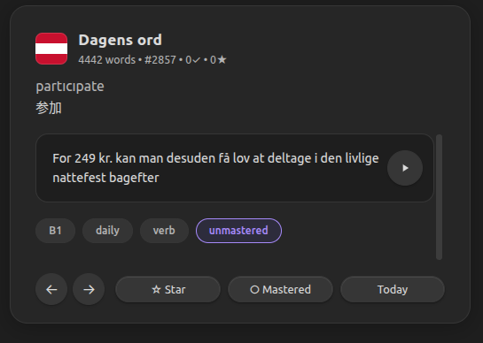
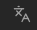

# Dagens Ord — Obsidian 每日丹麦语插件

[English](README.md)

基于 Anki 丹麦语频率词库（DDO Danish Frequency Deck）的 Obsidian 插件，界面参考「每日一词」卡片风格，使用本地 edge-tts 生成丹麦语例句发音。



## 功能

- 每日自动轮换单词（基于日期确定性选取）
- 词库导航（← →）、收藏、掌握标记
- 「今日」按钮跳回当天单词
- **单词发音**：Anki 词库内置丹麦语 MP3，开箱即用
- **例句发音**：通过本地 `edge-tts` 批量生成，存本地（无需 API Key）
- **CEFR 筛选**：在设置中单独开关 A1–C2 难度等级
- 深色主题，适配 Obsidian 默认暗色界面
- 学习进度本地保存

## 安装

1. 将整个 `obsidian-dagens-ord` 文件夹（含 `audio/anki/`）复制到 `.obsidian/plugins/`
2. 在 Obsidian 设置 → 第三方插件 中启用 **Dagens Ord**

## 使用

- 点击左侧功能区  图标，或命令面板搜索「打开每日丹麦语」
- 单词播放按钮：直接播放 Anki 内置发音
- 例句播放按钮：需先运行批量生成脚本（见下方）

## 开发者须知

### 批量生成例句语音（本地 edge-tts）

先确认本机已安装并可运行 `edge-tts`：

```bash
edge-tts --voice da-DK-ChristelNeural --text "Godmorgen, hvordan har du det?" --write-media "audio/test_da.mp3"
```

然后在插件目录运行：

```bash
python3 scripts/edge-tts-examples.py --jobs 4 --retries 3
```

脚本默认读取 `data/deck.json` 全量词库，给所有有例句的词生成 `audio/generated/ex-<word-id>.mp3`。已存在的音频会自动跳过，支持断点续传；如需重新生成，添加 `--overwrite`。默认并发数是 `--jobs 4`，如果网络稳定可以调到 `--jobs 8` 或更高。若遇到 `NoAudioReceived`，优先降低 `--jobs` 或提高 `--retries`。

### 导入中文词义

从中文 Anki `.apkg` 回填单词级中文释义到 `data/deck.json`：

```bash
npm run extract:zh
npm run build
```

脚本会写入：

- `translationZh`
- `translationsZh`

插件会在单词下方显示英文和中文释义。当前这两个 `.apkg` 不包含丹麦语例句的整句英中翻译，所以例句区域只显示丹麦语原句。

### 开发

```bash
npm install
npm run extract   # 从 .apkg 重新导出词库
npm run build     # 构建 main.js
```

### 词库来源

`DDO_Danish_Frequency_Deck_English.apkg` — `data/deck.json` 当前包含 4442 个丹麦语高频词，其中 4304 个带例句。插件默认使用全量 4442 个词作为每日学习范围，也可在设置里调小或按 CEFR 等级筛选。
